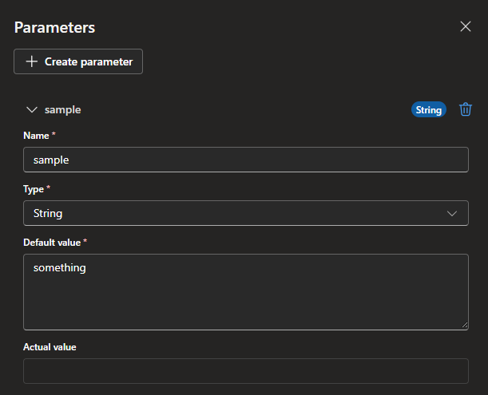
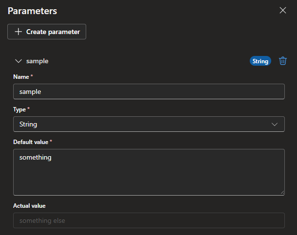

# Intro
So you have made some Consumption Logic Apps and now you're thinking about how to turn them into proper solutions with IaC and Bicep.

Let's first take a look on what happens when we insert a parameter inside the designer:

Now we have a parameter that we can use in our solution with the following values:
Name: sample
Type: String
Default value: something
Actual value:

And what we can now see by going to the Logic App code view section is something like this:
```json
{
    "definition": {
        "$schema": "https://schema.management.azure.com/providers/Microsoft.Logic/schemas/2016-06-01/workflowdefinition.json#",
        "contentVersion": "1.0.0.0",
        "triggers": {
            "When_a_HTTP_request_is_received": {
                "type": "Request",
                "kind": "Http"
            }
        },
        "actions": {
            "Compose": {
                "runAfter": {},
                "type": "Compose",
                "inputs": "@parameters('sample')"
            }
        },
        "outputs": {},
        "parameters": {
            "sample": {
                "defaultValue": "something",
                "type": "String"
            },
            "$connections": {
                "type": "Object",
                "defaultValue": {}
            }
        }
    },
    "parameters": {
        "$connections": {
            "type": "Object",
            "value": {}
        }
    }
}
```
This is now basically a usable template that you can use.

# Bicep template
Now let's take a look at how we could deploy this solution by turning it into a Bicep template. From the documentation we could see that the preferred way looks to be that the Bicep file itself would contain all the workflow information, this would honestly cause a lot of manual work so we're gonna sidestep that a little bit.

> [Logic Apps Bicep Documentation](https://learn.microsoft.com/en-us/azure/templates/microsoft.logic/workflows?pivots=deployment-language-bicep)

First order of business is taking in the actual Bicep file and what it needs, at minimum we have these:
```Bicep
param name string

resource logicAppConsumption 'Microsoft.Logic/workflows@2019-05-01' = {
  name: name
  location: location
  properties: {
    definition: definition
  }
}
```
The definition part has all the content that we can see in the Logic App code view so to have some nice separation we're going to do the following:
- Have a separate file where we copy everything from the Logic App code view, meaning that we can make changes from the portal and copy everything.
- Import that file in the Bicep in deployment
Now the file structure should look something like this:
```text
└─ LogicApp
   ├─ logicAppConsumption.bicep
   └─ workflow.json
```

Luckily we can do that with the file function in Bicep quite easily with loadJsonContent. When we load it as JSON we can also select only a part of the file, meaning we can take the content of the definition part that we need.

> [Bicep file functions](https://learn.microsoft.com/en-us/azure/azure-resource-manager/bicep/bicep-functions-files)

This results in the following:
```Bicep
param name string
var definitionFile = loadJsonContent('workflow.json').definition

resource logicAppConsumption 'Microsoft.Logic/workflows@2019-05-01' = {
  name: name
  location: location
  properties: {
    definition: definitionFile
  }
}
```
Now this is moving the definition to Bicep without having to manually fiddle around with it every time.

# Bicep Parameters
Unless you want to make a separate workflow each time for different environments, we would need to take a deeper look into how the parameters are set in the workflow file and the Bicep file. If you look at the workflow definition file in properties it shows something like this:
```text
├─ definition
│  ├─ parameters
│  ├─ triggers
│  └─ actions
│  └─ outputs
└─ parameters
```
Now this shows that parameters are listed twice in the workflow file, the definition/parameters shows the actual parameter that we originally created in the portal side. Now since we are importing this directly from the file we should leave it alone. The second is the template parameters that we can use to our advantage. We can modify the Bicep file to include these parameters and insert them to the parameters section:
```Bicep
param name string
param parameters object = {
  sample: {
    value: 'something else'
  }
var definitionFile = loadJsonContent('workflow.json').definition

resource logicAppConsumption 'Microsoft.Logic/workflows@2019-05-01' = {
  name: name
  location: location
  properties: {
    definition: definitionFile
    parameters: parameters
  }
}
```
Once you have deployed this template it will now properly show you that the parameter also has an actual value assigned:


# Separation of Environments
Now the next step is to have different values per environment. For that to work properly we are going to need some separate parameter files in our solution.
```text
└─ LogicApp
   ├─ logicAppConsumption.bicep
   ├─ logicAppConsumption.dev.bicepparam
   └─ workflow.json
```
Then we need to just tweak the solution slightly:
```Bicep
param name string
param parameters object
var definitionFile = loadJsonContent('workflow.json').definition

resource logicAppConsumption 'Microsoft.Logic/workflows@2019-05-01' = {
  name: name
  location: location
  properties: {
    definition: definitionFile
    parameters: parameters
  }
}
```
Parameter file:
```Bicep
using './logicAppConsumption.bicep'

param logicAppName = 'la-consumption'
param parameters = {
  sample: {
    value: 'something else'
  }
}
```
Now we can finally have a separate file for both the workflow definition so you can copy/paste it directly from the portal, use the native parameters inside the Logic App designer, have a static Bicep file for deployment and have a separate parameter file per environment. 

# TLDR
- Use the parameters inside the Logic App designer
- Copy/paste from the code view the workflow definition into a separate file
- In Bicep use the loadJsonContent().definition to insert the definition file
- Insert the template parameters in Bicep from a separate parameter file